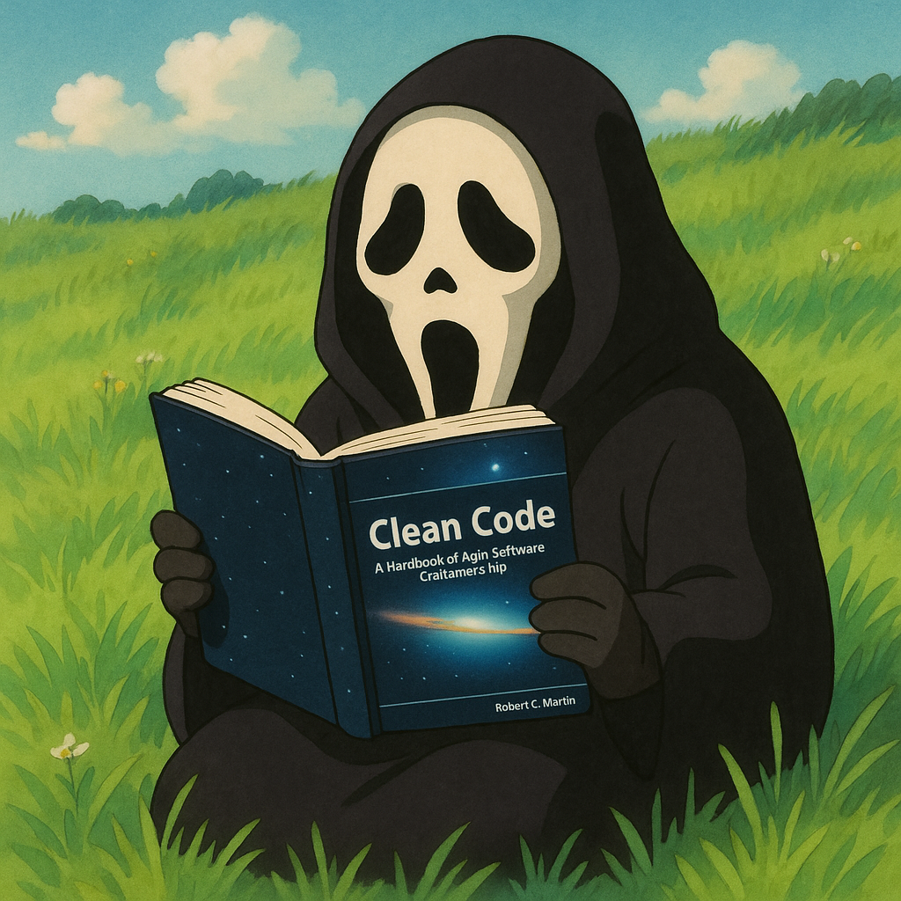

### Olá, eu sou a Valentina! 🙋🏻

##
### Tecnologias que uso no meu dia 👩🏻‍💻

     

##
Entusiasta na área da tecnologia da informação. Sempre curiosa e disposta a aprender mais sobre essa área encantadora que, desde pequena, sempre fui apaixonada. 🚀🧡

 

